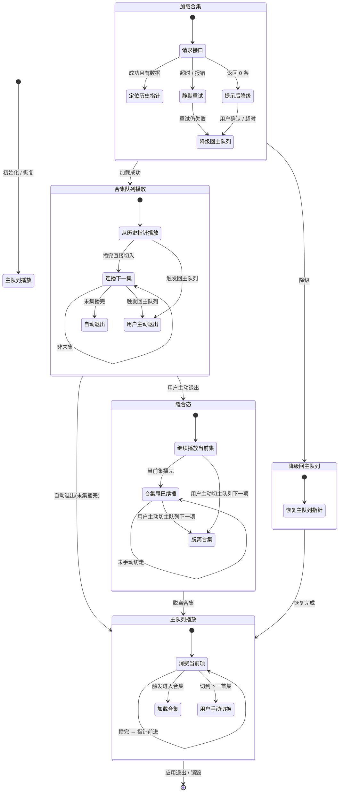

# 播放器队列设计方案

> 版本：v1.0 · 日期：2026-09-01 · 状态：已收口

---

## 一、设计目标

为短视频/剧集播放场景设计一套**双队列 + 缝合态**的播放调度模型，满足：

- 主推荐流（主队列）与合集连播（合集队列）的无缝切换；
- 合集内零干预连播；
- 用户任意时刻退出合集后，观看连续性不丢失；
- 异常场景有明确降级路径，不打断用户。

---

## 二、核心概念

| 概念 | 定义 |
|------|------|
| **主队列** | 常驻推荐流，元素为 `videoId + state`，指针消费即前进（方案 a） |
| **合集队列** | 单一槽位，进入时清空重灌；元素同为 `videoId + state`；进入时根据历史记录定位起始指针 |
| **缝合态** | 用户从合集中途退出后，当前集作为主队列与合集尾巴的衔接点，形成的过渡播放状态 |
| **指针预支** | 主队列采用"消费即前进"，进入合集前指针已指向下一首集，确保退出时衔接位置确定 |
| **合集尾巴** | 缝合态下，从当前集的下一集起、到合集末集为止的剩余序列 |

### 约束

- 合集层**不支持嵌套 / 栈**，同一时刻最多挂载一个合集。
- 历史播放记录是合集加载的**副作用产物**，不作为队列驱动源。

---

## 三、队列模型

### 3.1 主队列

```
[ A首集 ] [ B首集 ] [ C首集 ] [ D首集 ] ...
                ↑ 指针（预支后指向此处）
```

- 元素：`{ videoId, state }`
- 消费方式：播完当前项 → 指针 +1 → 自动播放下一项
- 替换规则：进入缝合态时，当前合集首集被替换为实际播放集，**替换永久生效**，直到主队列整体刷新 / 重置

### 3.2 合集队列

```
[ Ep1 ] [ Ep2 ] [ Ep3 ] ... [ EpN ]
              ↑ 指针（由历史定位）
```

- 元素：`{ videoId, state }`
- 加载：调用接口获取有序列表 → 根据历史记录定位起始指针
- 连播：播完直接切入下一集，**无倒计时、无干预**
- 末集播完：自动退出合集，无缝回到主队列指针所指位置

### 3.3 缝合态

```
主队列:  ... [ 第5集(替换) ] [ B首集 ] [ C首集 ] ...
                     ↓ 继续播
合集尾巴:  [ 第6集 ] [ 第7集 ] ... [ 第N集 ]
```

- 当前集不中断，播完后沿合集尾巴继续
- 用户主动消费主队列下一项（如 B 首集）时，才真正脱离合集
- 缝合态**跨暂停 / 锁屏 / 短暂离开保持**，不丢失
- 需要显式的**缝合标记**存于运行时状态，不可仅靠队列内容推导

---

## 四、状态流转

### 4.1 状态图



### 4.2 状态转换表

| 当前状态 | 触发事件 | 目标状态 | 关键动作 |
|----------|----------|----------|----------|
| 主队列播放 | 播完当前项 | 主队列播放 | 指针 +1，播放下一项 |
| 主队列播放 | 触发进入合集 | 加载合集 | 记录当前指针位置（预支） |
| 加载合集 | 接口成功 & 有数据 | 合集队列播放 | 根据历史定位指针 |
| 加载合集 | 超时 / 报错 → 重试失败 | 降级回主队列 | 静默恢复 |
| 加载合集 | 返回 0 条 | 降级回主队列 | 先提示，再恢复 |
| 合集队列播放 | 单集播完（非末集） | 合集队列播放 | 直接切入下一集 |
| 合集队列播放 | 末集播完 | 主队列播放 | 自动退出，无缝衔接主队列指针 |
| 合集队列播放 | 用户主动退出 | 缝合态 | 当前集继续播；主队列首集替换为当前集 |
| 缝合态 | 当前集播完 | 缝合态（尾巴续播） | 播合集下一集 |
| 缝合态 | 用户主动切主队列下一项 | 主队列播放 | 脱离合集，清除缝合标记 |
| 缝合态 | 再次触发同一合集 | 缝合态（不变） | 忽略，不做操作 |
| 降级回主队列 | 恢复完成 | 主队列播放 | 从预支指针继续 |

---

## 五、边界与异常处理

### 5.1 合集加载异常

| 异常类型 | 处理策略 | 用户感知 |
|----------|----------|----------|
| 接口超时 / 报错 | 先静默重试 → 仍失败则降级回主队列 | 无感知（静默） |
| 接口返回 0 条数据 | 先给用户提示 → 确认后降级回主队列 | 有提示（如 toast） |

### 5.2 缝合态边界

| 场景 | 处理 |
|------|------|
| 缝合期间暂停 / 锁屏 / 短暂离开后回来 | 缝合态保持，继续从当前进度播放 |
| 缝合期间再次点击同一合集"播放全部" | 忽略，维持当前播放状态 |
| 缝合期间用户主动切到主队列下一项 | 立即脱离合集，清除缝合标记和尾巴 |
| 缝合期间用户切到**另一个**合集 | 视为新的合集加载，先清除当前缝合态 |

### 5.3 主队列替换的生命周期

- 替换（合集首集 → 实际播放集）为**永久**生效；
- 仅当主队列**整体刷新 / 重置**时恢复为首集；
- 不因会话结束、应用重启而自动回退。

---

## 六、数据结构（逻辑层）

```
QueueItem {
    videoId: string        // 视频唯一标识
    state: PlaybackState   // 播放状态（未播/播放中/已播完/进度等）
}

MainQueue {
    items: QueueItem[]
    pointer: number        // 当前消费位置，消费即前进
}

CollectionQueue {
    items: QueueItem[]     // 接口返回的有序列表
    pointer: number        // 由历史定位
    collectionId: string   // 合集标识
}

StitchContext {
    active: boolean              // 缝合标记（显式存储）
    currentVideoId: string       // 当前正在播的集
    remainingTail: QueueItem[]   // 合集尾巴（当前集之后的部分）
    replacedIndex: number        // 主队列中被替换的位置
}
```

---

## 七、设计决策记录（ADR）

| # | 决策 | 备选方案 | 选择理由 |
|---|------|----------|----------|
| 1 | 主队列指针消费即前进（方案 a） | b: 播完再前进 | 预支语义明确，退出合集后衔接位置确定 |
| 2 | 合集播完末集 → 自动回主队列（方案 b） | a: 停住 / c: 循环 / d: 延迟退出 | 符合"刷剧"连续体验，无需用户干预 |
| 3 | 加载中途退出 → 缝合态（继续播当前集） | 中断式 / 完成式 | 不中断观看 + 保留连续性 |
| 4 | 主队列替换永久生效（方案 a） | b: 会话级 / c: 依历史判断 | 逻辑简单，避免状态推导歧义 |
| 5 | 缝合态跨中断保持（方案 a） | b: 中断后丢失 | 避免意外中断覆盖用户意图 |
| 6 | 缝合期间重入同一合集 → 忽略 | 重置 / 跳转 | 防止误触打断观看 |
| 7 | 合集不支持嵌套 / 栈 | 支持多层 | 降低状态复杂度，MVP 够用 |

---

## 八、待后续跟进

- [ ] 缝合标记的**持久化方案**（本地存储 vs 内存 + 恢复策略）
- [ ] 预加载策略（主队列下一项 & 合集下一集的预加载时机）
- [ ] 事件总线 / 消息通道的技术选型
- [ ] 主队列"整体刷新 / 重置"的触发条件与频率
- [ ] 埋点方案：缝合态进入/退出、合集完播率、降级触发次数

---

*本文档为设计阶段产出，开发实现时如有偏差，请回溯至对应 ADR 条目讨论后更新。*
